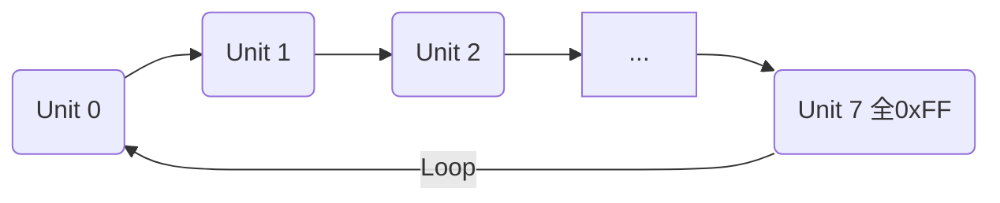

---

# RingLog Flash 存储系统设计说明书

**版本**：V1.0

**日期**：2026-01-28

**模块**：RingLog Flash Storage

---

## 1. 引言 (Introduction)

### 1.1 编写目的

本文档旨在详细描述基于 SPI/QSPI NOR Flash 的 **环形日志/配置存储系统 (RingLog)** 的软件架构、数据结构及核心算法。该模块专为嵌入式系统设计，用于实现配置参数或运行日志的掉电保存、循环覆盖及磨损均衡。

### 1.2 适用范围

本设计适用于资源受限的 MCU 系统（如 STM32），底层依赖 QSPI/SPI Flash 驱动接口。

### 1.3 关键特性

* **磨损均衡 (Wear Leveling)**：通过环形写入机制，均匀分布 Flash 擦写操作，避免单点过早失效。
* **掉电保护 (Power-Loss Protection)**：采用 Magic（魔数）+ Checksum（校验和）双重验证机制，防止掉电导致的数据损坏。
* **自动循环 (Auto-Rotation)**：存储空间写满后，自动擦除最旧数据并覆盖，无需人工干预。
* **自愈初始化 (Self-Healing Init)**：上电时自动扫描 Flash 状态，恢复写入游标，确保数据连续性。

---

## 2. 系统架构 (System Architecture)

### 2.1 硬件抽象层

本模块位于 Flash 驱动层之上，依赖以下底层 API：

* **页读取** (`qspi_nor_page_read`): 支持任意地址读取。
* **页写入** (`qspi_nor_page_write`): 支持页编程。
* **扇区擦除** (`qspi_nor_sec_erase`): 最小擦除单位为 4KB。

### 2.2 存储布局 (Memory Layout)

Flash 空间逻辑上被划分为若干 **扇区 (Sector)** 和 **单元 (Unit)**。根据源码 `ringlog_flash.h` 配置：

| 参数项 | 宏定义 | 值 | 说明 |
| --- | --- | --- | --- |
| **基地址** | `FLASH_BASE_ADDR` | `0x7E0000` | Flash 存储起始偏移量 |
| **总容量** | `FLASH_SIZE` | 32 KB | 32 * 1024 Bytes |
| **扇区大小** | `SECTOR_SIZE` | 4 KB | 物理最小擦除单位 |
| **单元大小** | `UNIT_SIZE` | 4 KB | 逻辑最小写入单位 |
| **单元配置** | `UNITS_PER_SECTOR` | 1 | **关键设计**：1 Unit 占用 1 Sector |
| **单元总数** | `TOTAL_UNITS` | 8 | 总计 8 个存储槽位 |

**环形缓冲区拓扑图：**



>注意：设计上通过一个全0xff的block来定位末尾文件写入位置

---

## 3. 数据结构设计 (Data Structures)

### 3.1 存储单元结构 (Storage Unit)

每个存储单元 (Unit) 由 **头部 (Header)** 和 **数据载荷 (Payload)** 组成。

**头部定义 (`cfg_hdr_t`):**

| 偏移 | 字段名 | 类型 | 描述 |
| --- | --- | --- | --- |
| 0x00 | `magic` | `uint32_t` | 固定标识 `0x43464721` ("CFG!") |
| 0x04 | `length` | `uint32_t` | 有效数据载荷长度 |
| 0x08 | `checksum` | `uint32_t` | 数据载荷的 XOR 校验和 |
| 0x0C | `payload` | `uint8_t[]` | 实际存储的数据内容 |

**C语言定义:**

```c
#pragma pack(4)
typedef struct {
    uint32_t magic;     // CFG_MAGIC
    uint32_t length;    // Data Length
    uint32_t checksum;  // XOR Checksum of Payload
} cfg_hdr_t;
#pragma pack()

```

### 3.2 运行时控制块 (Control Block)

内存中维护的句柄，用于记录当前的写入位置。

```c
typedef struct {
    uint32_t write_unit; // 当前写入游标索引 (0 ~ TOTAL_UNITS-1)
} ring_log_t;

```

---

## 4. 核心逻辑流程 (Core Logic)

### 4.1 初始化与自愈 (`ring_log_init`)

**目标**：上电时扫描 Flash，寻找“最新的空闲位置”作为写入起点。

**算法步骤**：

1. **全局遍历**：扫描 Flash 所有 Unit (0 ~ 7)。
2. **空闲检测**：读取 Unit 前 64 字节，检查是否全为 `0xFF`。
3. **游标定位**：
* **命中**：找到第一个“空” Unit，将其索引赋给 `write_unit`。
* **全满**：若所有 Unit 均非空，则强制重置 `write_unit = 0`，并擦除 Unit 0。


### 4.2 数据写入 (`ringlog_flash_write`)

**策略**：预擦除 (Guard Erase) + 覆盖写。

**算法步骤**：

1. **参数校验**：确认 `len <= UNIT_SIZE - sizeof(cfg_hdr_t)`。
2. **预擦除保护**：
* 计算 **下一个** 扇区的地址：`next_sector_addr`。
* 擦除该扇区。
* *作用*：在写入当前数据的同时，清理前方道路，确保环形结构始终有一个“断点”，防止数据首尾混淆。


3. **数据封装**：
* 计算 Payload 的 XOR Checksum。
* 构建 Header。


4. **物理写入**：将 `Header + Payload` 写入当前 `write_unit`。
5. **游标更新**：`write_unit = (write_unit + 1) % TOTAL_UNITS`。

### 4.3 读取最新数据 (`ringlog_flash_read`)

**策略**：倒序回溯 (Backward Traversal)。

**算法步骤**：

1. **回溯遍历**：从 `write_unit` 开始，逆时针方向（Index - 1）逐个扫描 Unit。
* *索引计算*: `curr = (write_unit + TOTAL_UNITS - i) % TOTAL_UNITS`。


2. **有效性验证**：
* **Magic 校验**: `header.magic == CFG_MAGIC`?
* **长度校验**: `header.length` 是否合理?
* **完整性校验**: 读取 Payload 并重算 Checksum，与 Header 对比。


3. **命中返回**：
* 找到第一个通过校验的 Unit，即为 **最新有效数据**。
* 拷贝数据至用户 Buffer。


4. **未找到**：遍历一圈无果，返回错误。

---

## 5. 接口说明 (API Reference)

### 5.1 初始化

```c
int ringlog_flash_init(void);

```

* **功能**: 模块初始化，恢复游标。
* **返回**: 0 成功。

### 5.2 写入

```c
int ringlog_flash_write(void *input_buf, uint32_t buf_size);

```

* **参数**:
* `input_buf`: 数据源指针。
* `buf_size`: 数据长度。


* **返回**: 0 成功, -1 失败 (长度超限等)。

### 5.3 读取

```c
int ringlog_flash_read(void *out_buf, uint32_t buf_size, uint32_t *out_len);

```

* **参数**:
* `out_buf`: 接收缓冲区。
* `buf_size`: 缓冲区最大容量。
* `out_len`: (输出) 实际读取长度。


* **返回**: 0 成功, -1 未找到数据。

---

## 6. 设计评估与风险提示


| 评估项 | 说明 |
| --- | --- |
| **优势** | 1. **实现轻量**: 无文件系统开销，代码极简。<br>2. **寿命优化**: 扇区轮询写入，最大化 Flash 寿命。<br>3. **数据安全**: 严格的校验机制防止脏读。 |
| **局限性** | **空间利用率低**: 当前配置 `UNITS_PER_SECTOR=1`，即写入 10 字节也会占用 4KB 物理空间。**仅适合存储少量大块数据（如系统配置结构体）。** |
| **风险提示** | **栈溢出 (Stack Overflow)**: 源码 `ring_cfg_write` 和 `read` 中使用了 `uint8_t buf[UNIT_SIZE]` (4KB) 的局部变量。在 MCU 环境下极易导致栈溢出，**建议改为全局静态 Buffer 或分段读写优化**。 |


## 7. 使用注意事项

1. 使用一块全`0xff`的`block`来定位数据末尾写入位置
2. 对于写入参数，如果本来是3个参数，新程序5个参数，那么会把之前的参数复制进来
3. 2的补充回答，参数应该只增不减，不用的参数保留即可，不要打乱顺序